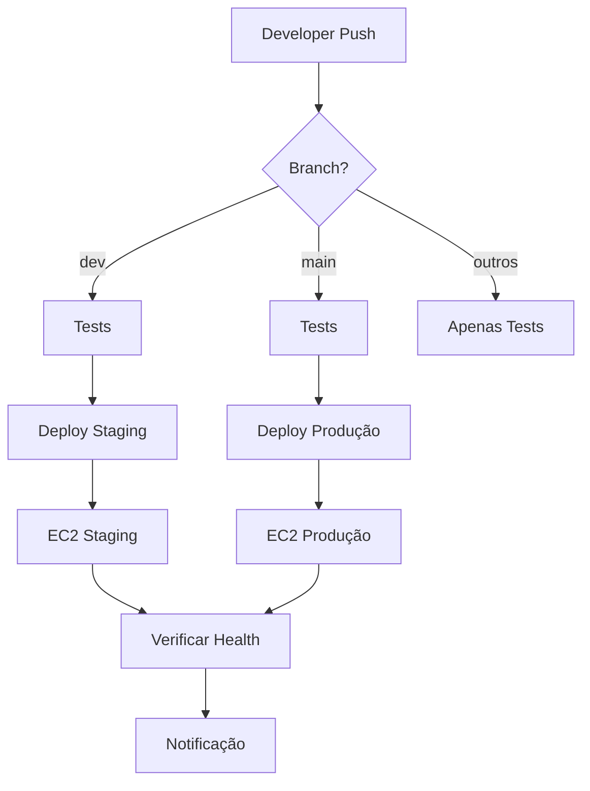

# 🚀 CI/CD Pipeline - MIT Logistics

## Visão Geral

Pipeline automatizado usando **GitHub Actions** para deploy contínuo da Gatekeeper API.

## 🏗️ Arquitetura



## 📋 Ambientes

| Ambiente | Branch | URL | Banco |
|----------|--------|-----|-------|
| **Staging** | `dev` | ec2-13-217-85-36.compute-1.amazonaws.com | `mit_logistics` |
| **Produção** | `main` | (configurar) | `mit_logistics_prod` |

## 🔄 Fluxos de Deploy

### ✅ **Automáticos:**
- **Push em `dev`** → Deploy staging
- **Push em `main`** → Deploy produção  
- **PR para `main`** → Apenas testes

### 🎛️ **Manual:**
```bash
# Usando script local
./deploy.sh staging   # Deploy para dev
./deploy.sh production # Deploy para prod

# Via GitHub Actions
# GitHub → Actions → Run workflow
```

## 📦 O que o Pipeline faz

1. **🧪 Tests:** Executa testes automatizados
2. **📦 Build:** Prepara ambiente Python
3. **🚀 Deploy:** 
   - Conecta no EC2 via SSH
   - Backup da versão atual
   - Instala nova versão
   - Configura ambiente
   - Reinicia serviços
4. **🏥 Health Check:** Verifica se API respondeu
5. **📢 Notificação:** Status do deploy

## ⚙️ Configuração Inicial

### 1. Secrets no GitHub
Ver: `.github/SECRETS_SETUP.md`

### 2. Chave SSH Local
```bash
# Colocar mit-api-key.pem na raiz do projeto
chmod 400 mit-api-key.pem
```

### 3. Variáveis de Ambiente
Configuradas automaticamente pelo pipeline.

## 🧪 Testando Localmente

```bash
# Testar conexão SSH
ssh -i mit-api-key.pem ubuntu@ec2-13-217-85-36.compute-1.amazonaws.com "echo 'OK'"

# Deploy manual
./deploy.sh staging

# Verificar se funcionou
curl https://ec2-13-217-85-36.compute-1.amazonaws.com/health
```

## 📊 Monitoramento

### ✅ **Health Checks:**
- Durante deploy: `curl localhost:8000/health`
- Público: `https://ec2-13-217-85-36.compute-1.amazonaws.com/health`

### 📝 **Logs:**
```bash
# No EC2
sudo journalctl -u gatekeeper-api -f
sudo systemctl status gatekeeper-api
```

### 📈 **GitHub Actions:**
- Repository → Actions tab
- Ver logs detalhados de cada deploy

## 🔧 Troubleshooting

### ❌ **Deploy Falhou:**
1. Verificar logs no Actions
2. SSH no servidor e verificar:
   ```bash
   sudo systemctl status gatekeeper-api
   sudo journalctl -u gatekeeper-api -n 50
   ```

### 🐛 **Aplicação não subiu:**
- Verificar .env
- Dependências Python
- OCR instalado
- MongoDB conectando

### 🔐 **SSH Falhando:**
- Secret `EC2_SSH_KEY` completo?
- Security Group permite SSH?
- IP do servidor correto?

## 🚀 Próximos Passos

1. **✅ Configurar secrets** 
2. **✅ Fazer primeiro deploy**
3. **⏳ Instância de produção** (separada)
4. **⏳ Monitoramento** (logs, métricas)
5. **⏳ Rollback automático**
6. **⏳ Testes de integração**

## 📚 Recursos

- [GitHub Actions Docs](https://docs.github.com/en/actions)
- [SSH Action](https://github.com/appleboy/ssh-action)
- [AWS EC2 Best Practices](https://docs.aws.amazon.com/AWSEC2/latest/UserGuide/ec2-best-practices.html)