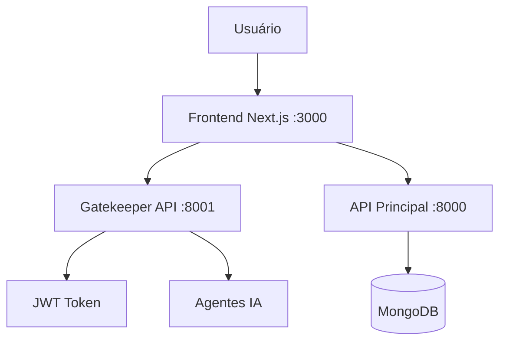

# 🔐 MIT Tracking System v4.0 - JWT Authentication

Sistema de logística inteligente com autenticação JWT real e chat integrado.

## 🚀 Início Rápido

### Iniciar Sistema JWT
```bash
./start-system-jwt.sh
```

### Parar Sistema
```bash
./stop-system-jwt.sh
```

## 🌐 Serviços e Portas

| Serviço | Porta | URL | Descrição |
|---------|-------|-----|-----------|
| **Frontend Original** | 8080 | http://localhost:8080 | Sistema completo (Vite) |
| **Frontend JWT** | 3000 | http://localhost:3000 | Sistema de autenticação (Next.js) |
| **API Principal** | 8000 | http://localhost:8000/docs | API GraphQL e REST |
| **Gatekeeper API** | 8001 | http://localhost:8001/docs | Autenticação JWT e roteamento |

## 🔑 Sistema de Autenticação

### Login JWT
- **URL**: http://localhost:3000/auth
- **Email**: Qualquer email (sistema demo)
- **Senha**: Opcional para demonstração
- **Exemplo**: `admin@logistica.com.br`

### Chat Autenticado
- **URL**: http://localhost:3000/chat
- **Acesso**: Apenas usuários autenticados
- **Agentes**: Roteamento baseado no role do usuário

### Sistema Completo Original
- **URL**: http://localhost:8080
- **Funcionalidades**: Dashboard, API Explorer, Agent Tester, Orders, Search
- **Monitoramento**: http://localhost:8080/monitoring

## 🎯 Funcionalidades Principais

### ✅ Implementadas
- [x] **Autenticação JWT Real**: Login com tokens do Gatekeeper
- [x] **Chat Exclusivamente Autenticado**: Sem acesso público
- [x] **Roteamento de Agentes**: Baseado no role do usuário
- [x] **Store Zustand**: Gerenciamento de estado com JWT
- [x] **Fallback Inteligente**: Token real → localStorage → mock
- [x] **Build TypeScript**: Todos os tipos corrigidos

### 🎯 Arquitetura



## 🔧 Desenvolvimento

### Estrutura do Projeto
```
MIT/
├── frontend/              # Next.js com JWT
├── gatekeeper-api/        # FastAPI (portas 8000 e 8001)
├── start-system-jwt.sh    # Script de inicialização
├── stop-system-jwt.sh     # Script de parada
└── README-JWT.md          # Este arquivo
```

### Componentes Principais
- **JWTLogin**: Componente de login com Gatekeeper
- **AuthenticatedChat**: Interface de chat protegida
- **useAuthenticatedChat**: Hook para gerenciar chat
- **gatekeeperClient**: Cliente API para JWT

### Logs de Debug
```bash
# API Principal
tail -f /tmp/api-main.log

# Gatekeeper
tail -f /tmp/gatekeeper.log

# Frontend
tail -f /tmp/frontend-jwt.log
```

## 🔄 Fluxo de Autenticação

1. **Login**: `POST /auth/login` → Recebe JWT token
2. **Armazenamento**: Token salvo no Zustand + localStorage
3. **Requests**: Todas as chamadas incluem `Authorization: Bearer <token>`
4. **Chat**: Apenas usuários autenticados podem acessar
5. **Agentes**: Roteamento baseado no role (admin, logistics, finance, operator)

## 📊 Status dos Serviços

Após iniciar com `./start-system-jwt.sh`, verifique:

```bash
# Health checks
curl http://localhost:8000/health  # API Principal
curl http://localhost:8001/health  # Gatekeeper

# Testar login
curl -X POST http://localhost:8001/auth/login \
  -H "Content-Type: application/json" \
  -d '{"email": "admin@logistica.com.br"}'
```

## 🐛 Troubleshooting

### Portas Ocupadas
```bash
./stop-system-jwt.sh  # Para tudo
./start-system-jwt.sh # Reinicia
```

### Problemas de JWT
- Verificar logs do Gatekeeper: `tail -f /tmp/gatekeeper.log`
- Limpar localStorage no browser: F12 → Application → Storage
- Verificar token no Zustand DevTools

### Build Errors
```bash
cd frontend
npm run build  # Verificar erros TypeScript
```

## 🚀 Deploy

O sistema está pronto para produção com:
- JWT tokens reais
- Autenticação obrigatória
- Chat protegido
- Build TypeScript sem erros

Para deploy, configure as variáveis de ambiente:
```env
NEXT_PUBLIC_GATEKEEPER_URL=http://your-gatekeeper:8001
JWT_SECRET=your-production-secret-key
```

### Índice Semântico de Documentos
Para habilitar e ajustar a indexação vetorial automática após o OCR, use as variáveis:
```env
# Ativa/desativa a indexação semântica durante o processamento de documentos
SEMANTIC_INDEX_ENABLED=true

# Tamanho máximo de cada chunk em caracteres e sobreposição entre chunks
DOCUMENT_INDEX_CHUNK_SIZE=1500
DOCUMENT_INDEX_CHUNK_OVERLAP=200
```
Caso esteja rodando sem `sentence-transformers`, defina `SEMANTIC_INDEX_ENABLED=false` até instalar as dependências de embedding.
