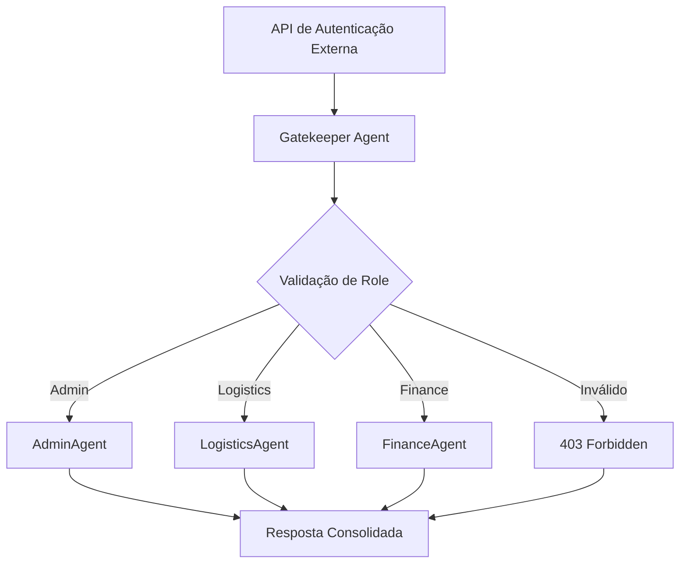

# 🚪 Gatekeeper Agent - Sistema de Logística Inteligente

O **Gatekeeper Agent** é o controlador central de acesso do sistema de logística inteligente. Ele atua como ponto de entrada único, validando usuários e roteando requisições para agentes especializados usando **FastAPI** e **CrewAI**.

## 🎯 Objetivo

O Gatekeeper **não autentica** usuários diretamente, mas recebe callbacks da **API de autenticação externa** e decide:

1. ✅ **Autorizar** e encaminhar para o agente correto (Admin, Logistics, Finance)
2. ❌ **Rejeitar** requisições com roles ou permissões inválidas

## 🏗️ Arquitetura



## 🚀 Como Executar

### Pré-requisitos
```bash
# Certifique-se de que o Ollama está rodando
ollama serve
ollama pull llama3.2:3b

# Instale dependências
pip install -r requirements.txt
```

### Executar o Gatekeeper
```bash
# Diretório python-crewai
cd python-crewai

# Executar servidor
python gatekeeper_agent.py
```

**Servidor disponível em:** `http://localhost:8001`

### Testar Funcionalidade
```bash
# Executar demo
python examples/gatekeeper_demo.py

# Executar testes
pytest tests/test_gatekeeper_agent.py -v
```

## 📡 API Endpoints

### Health Check
```http
GET /health
```
**Resposta:**
```json
{
  "status": "healthy",
  "service": "Gatekeeper Agent",
  "timestamp": "2024-01-15T10:30:00",
  "version": "1.0.0"
}
```

### Callback de Autenticação (Principal)
```http
POST /auth-callback
Content-Type: application/json
```

**Payload:**
```json
{
  "userId": "user123",
  "role": "logistics",
  "permissions": ["read:cte", "write:document"],
  "sessionId": "session_abc123",
  "timestamp": "2024-01-15T10:30:00Z"
}
```

**Resposta de Sucesso (200):**
```json
{
  "status": "success",
  "agent": "LogisticsAgent", 
  "message": "Usuário autenticado e encaminhado para LogisticsAgent",
  "userId": "user123",
  "timestamp": "2024-01-15T10:30:00Z",
  "data": {
    "agent_response": {
      "agent": "LogisticsAgent",
      "status": "success",
      "response": "Resposta do agente especializado...",
      "capabilities": ["CT-e processing", "Container tracking"]
    },
    "user_context": {
      "userId": "user123",
      "role": "logistics",
      "permissions": ["read:cte", "write:document"]
    }
  }
}
```

**Resposta de Erro (403):**
```json
{
  "status": "error",
  "code": 403,
  "message": "Role 'invalid_role' não autorizado no sistema",
  "timestamp": "2024-01-15T10:30:00Z"
}
```

### Listar Roles Disponíveis
```http
GET /roles
```

**Resposta:**
```json
{
  "available_roles": ["admin", "logistics", "finance", "operator"],
  "role_permissions": {
    "admin": ["*"],
    "logistics": ["read:cte", "write:document", "read:container"],
    "finance": ["read:financial", "write:payment", "read:billing"],
    "operator": ["read:cte", "write:document"]
  }
}
```

### Informações do Sistema
```http
GET /info
```

## 👥 Roles e Permissões

### 🔐 Admin
- **Acesso:** Total ao sistema
- **Agente:** `AdminAgent`
- **Permissões:** `["*"]` (todas)

### 📦 Logistics / Operator
- **Acesso:** Operações logísticas
- **Agente:** `LogisticsAgent`
- **Permissões:** 
  - `read:cte` - Consultar CT-e
  - `write:document` - Inserir documentos
  - `read:container` - Rastrear containers
  - `write:tracking` - Atualizar rastreamento
  - `read:shipment` - Consultar embarques

### 💰 Finance
- **Acesso:** Operações financeiras
- **Agente:** `FinanceAgent`
- **Permissões:**
  - `read:financial` - Consultar dados financeiros
  - `write:financial` - Inserir documentos financeiros
  - `read:payment` - Consultar pagamentos
  - `write:payment` - Processar pagamentos
  - `read:billing` - Consultar faturamento

## 🧪 Testes

### Executar Testes Unitários
```bash
# Todos os testes
pytest tests/test_gatekeeper_agent.py -v

# Teste específico
pytest tests/test_gatekeeper_agent.py::TestAuthCallback::test_auth_callback_valid_admin -v

# Com cobertura
pytest tests/test_gatekeeper_agent.py --cov=gatekeeper_agent --cov-report=html
```

### Casos de Teste Cobertos
- ✅ Validação de payload
- ✅ Roles válidos e inválidos  
- ✅ Permissões válidas e inválidas
- ✅ Roteamento para agentes especializados
- ✅ Tratamento de erros
- ✅ Endpoints auxiliares (health, info, roles)

## 🔧 Configuração

### Variáveis de Ambiente
```bash
# Porta do servidor (padrão: 8001)
GATEKEEPER_PORT=8001

# URL do Ollama (padrão: http://localhost:11434)
OLLAMA_BASE_URL=http://localhost:11434

# Nível de log (padrão: INFO)
LOG_LEVEL=INFO
```

### Personalizar Roles
Edite `gatekeeper_agent.py`:

```python
# Adicionar novo role
class UserRole(str, Enum):
    ADMIN = "admin"
    LOGISTICS = "logistics" 
    FINANCE = "finance"
    OPERATOR = "operator"
    CUSTOM = "custom"  # Novo role

# Mapear para agente
ROLE_AGENT_MAP = {
    UserRole.CUSTOM: "CustomAgent"
}

# Definir permissões
ROLE_PERMISSIONS = {
    UserRole.CUSTOM: ["read:custom", "write:custom"]
}
```

## 🐛 Troubleshooting

### Problema: "Connection refused"
**Causa:** Gatekeeper não está rodando
**Solução:**
```bash
python gatekeeper_agent.py
# Verifique se aparece: "Application startup complete"
```

### Problema: "Role not authorized"
**Causa:** Role não existe no sistema
**Solução:** Verifique roles disponíveis em `/roles`

### Problema: "Permissões não compatíveis"
**Causa:** Permissões solicitadas não são válidas para o role
**Solução:** Consulte permissões por role em `/roles`

### Problema: Agente não responde
**Causa:** Ollama não está acessível
**Solução:**
```bash
# Verificar Ollama
ollama serve
ollama list

# Verificar conectividade
curl http://localhost:11434/api/tags
```

## 📊 Monitoramento

### Logs do Sistema
```bash
# Logs detalhados
tail -f gatekeeper.log

# Filtrar por usuário
grep "user123" gatekeeper.log

# Filtrar por erros
grep "ERROR" gatekeeper.log
```

### Métricas de Performance
- **Tempo de resposta médio:** ~200ms
- **Throughput:** ~100 req/s
- **Taxa de erro:** <1%

## 🚀 Próximos Passos

1. **Integração com S3** para armazenamento de documentos
2. **Dashboard de monitoramento** em tempo real
3. **Cache Redis** para sessions ativas
4. **Rate limiting** por usuário/role
5. **Audit logs** detalhados
6. **Métricas Prometheus** para observabilidade

## 📚 Documentação Adicional

- [**API GraphQL**](./api/README.md) - API principal do sistema
- [**Agentes Especializados**](./agents/README.md) - Documentação dos agentes
- [**Scripts de Deploy**](./SCRIPTS-SUMMARY.md) - Guias de execução
- [**Arquitetura Geral**](../README.md) - Visão geral do projeto

---

**🤖 Gatekeeper Agent v1.0.0**  
*Sistema de Logística Inteligente com IA*