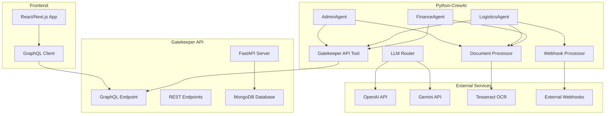

# Sistema Gatekeeper - Documentação Completa

## 📋 Índice

1. [Visão Geral](#visão-geral)
2. [Arquitetura do Sistema](#arquitetura-do-sistema)
3. [Guia DevOps - Instalação e Configuração](#guia-devops---instalação-e-configuração)
4. [Configuração das Ferramentas](#configuração-das-ferramentas)
5. [Guia de Uso das Ferramentas](#guia-de-uso-das-ferramentas)
6. [Agentes Especializados](#agentes-especializados)
7. [Integração com Frontend](#integração-com-frontend)
8. [Monitoramento e Logs](#monitoramento-e-logs)
9. [Solução de Problemas](#solução-de-problemas)
10. [Exemplos Práticos](#exemplos-práticos)

---

## 🎯 Visão Geral

O Sistema Gatekeeper é uma plataforma completa de automação logística que utiliza agentes de IA especializados para processar documentos, gerenciar dados logísticos e fornecer insights em tempo real. O sistema é composto por três componentes principais:

- **Frontend React/Next.js** - Interface web para usuários
- **Gatekeeper API (FastAPI)** - API REST/GraphQL para gerenciamento de dados
- **Python-CrewAI** - Sistema de agentes de IA especializados

### 🔑 Funcionalidades Principais

- ✅ Processamento automático de documentos (CT-e, PDFs, imagens)
- ✅ Agentes especializados em Administração, Logística e Financeiro
- ✅ Integração GraphQL para dados em tempo real
- ✅ Sistema de webhooks para eventos logísticos
- ✅ OCR avançado com IA para extração de dados
- ✅ Roteamento inteligente entre OpenAI e Gemini
- ✅ Monitoramento e logs centralizados

---

## 🏗️ Arquitetura do Sistema



---

## ⚙️ Guia DevOps - Instalação e Configuração

### 1. Pré-requisitos do Sistema

```bash
# Ubuntu/Debian
sudo apt update
sudo apt install -y python3.12 python3.12-venv python3-pip
sudo apt install -y nodejs npm
sudo apt install -y mongodb-server
sudo apt install -y tesseract-ocr tesseract-ocr-por
sudo apt install -y git docker docker-compose

# CentOS/RHEL
sudo yum install -y python3.12 python3-pip nodejs npm mongodb-org tesseract git docker docker-compose
```

### 2. Clonagem e Estrutura do Projeto

```bash
# Clonar repositório
git clone <repository-url> mit-logistics
cd mit-logistics

# Estrutura esperada:
# ├── frontend/                 # React/Next.js app
# ├── gatekeeper-api/          # FastAPI backend
# └── python-crewai/           # Sistema de agentes IA
```

### 3. Configuração do Backend (Gatekeeper API)

```bash
cd gatekeeper-api

# Criar ambiente virtual
python3.12 -m venv venv
source venv/bin/activate

# Instalar dependências
pip install -r requirements.txt

# Configurar variáveis de ambiente
cp .env.example .env
nano .env
```

**Arquivo .env do Gatekeeper API:**

```env
# Database
MONGODB_URL=mongodb://localhost:27017
DATABASE_NAME=gatekeeper

# API Configuration  
API_HOST=0.0.0.0
API_PORT=8001
DEBUG=true

# JWT Security
JWT_SECRET_KEY=your-super-secret-jwt-key-here
JWT_ALGORITHM=HS256
JWT_ACCESS_TOKEN_EXPIRE_MINUTES=1440

# CORS
CORS_ORIGINS=["http://localhost:3000", "http://localhost:8000"]

# AWS S3 (para upload de arquivos)
AWS_ACCESS_KEY_ID=your-aws-access-key
AWS_SECRET_ACCESS_KEY=your-aws-secret-key
AWS_S3_BUCKET=your-s3-bucket
AWS_REGION=us-east-1

# External APIs
OPENAI_API_KEY=your-openai-api-key
GOOGLE_API_KEY=your-gemini-api-key
```

### 4. Configuração do Sistema de Agentes (Python-CrewAI)

```bash
cd ../python-crewai

# Criar ambiente virtual
python3.12 -m venv venv
source venv/bin/activate

# Instalar dependências
pip install -r requirements.txt

# Configurar variáveis de ambiente
cp .env.example .env
nano .env
```

**Arquivo .env do Python-CrewAI:**

```env
# AI APIs
OPENAI_API_KEY=your-openai-api-key
GOOGLE_API_KEY=your-gemini-api-key

# Gatekeeper API
GATEKEEPER_API_URL=http://localhost:8001
GATEKEEPER_API_KEY=your-api-key

# Webhook Configuration
WEBHOOK_PORT=8002
WEBHOOK_SECRET=your-webhook-secret

# OCR Configuration
TESSERACT_PATH=/usr/bin/tesseract
OCR_LANGUAGES=por,eng

# Logging
LOG_LEVEL=INFO
LOG_FILE=logs/agents.log

# MongoDB (se usado diretamente)
MONGODB_URL=mongodb://localhost:27017
DATABASE_NAME=crewai_logs
```

### 5. Configuração do Frontend

```bash
cd ../frontend

# Instalar dependências
npm install

# Configurar variáveis de ambiente
cp .env.local.example .env.local
nano .env.local
```

**Arquivo .env.local do Frontend:**

```env
# API Configuration
NEXT_PUBLIC_API_URL=http://localhost:8001
NEXT_PUBLIC_GRAPHQL_URL=http://localhost:8001/graphql

# Authentication
NEXTAUTH_URL=http://localhost:3000
NEXTAUTH_SECRET=your-nextauth-secret

# Features
NEXT_PUBLIC_ENABLE_AI_FEATURES=true
NEXT_PUBLIC_ENABLE_WEBHOOKS=true
```

### 6. Inicialização dos Serviços

#### Opção A: Docker Compose (Recomendado para Produção)

```bash
# Na raiz do projeto
docker-compose up -d

# Verificar status
docker-compose ps

# Logs
docker-compose logs -f
```

**docker-compose.yml:**

```yaml
version: '3.8'

services:
  mongodb:
    image: mongo:7
    container_name: gatekeeper-mongo
    ports:
      - "27017:27017"
    environment:
      MONGO_INITDB_DATABASE: gatekeeper
    volumes:
      - mongodb_data:/data/db
    restart: unless-stopped

  gatekeeper-api:
    build: ./gatekeeper-api
    container_name: gatekeeper-api
    ports:
      - "8001:8001"
    environment:
      - MONGODB_URL=mongodb://mongodb:27017
    depends_on:
      - mongodb
    restart: unless-stopped
    volumes:
      - ./logs:/app/logs

  python-crewai:
    build: ./python-crewai
    container_name: python-crewai
    ports:
      - "8002:8002"
    environment:
      - GATEKEEPER_API_URL=http://gatekeeper-api:8001
    depends_on:
      - gatekeeper-api
    restart: unless-stopped
    volumes:
      - ./logs:/app/logs
      - ./uploads:/app/uploads

  frontend:
    build: ./frontend
    container_name: gatekeeper-frontend
    ports:
      - "3000:3000"
    environment:
      - NEXT_PUBLIC_API_URL=http://localhost:8001
    depends_on:
      - gatekeeper-api
    restart: unless-stopped

volumes:
  mongodb_data:
```

#### Opção B: Execução Manual (Desenvolvimento)

```bash
# Terminal 1 - MongoDB
sudo systemctl start mongod

# Terminal 2 - Gatekeeper API
cd gatekeeper-api
source venv/bin/activate
uvicorn app.main:app --host 0.0.0.0 --port 8001 --reload

# Terminal 3 - Python-CrewAI 
cd python-crewai
source venv/bin/activate
python -c "from tools.webhook_processor import WebhookProcessor; import asyncio; asyncio.run(WebhookProcessor().start_server())"

# Terminal 4 - Frontend
cd frontend
npm run dev
```

### 7. Verificação da Instalação

```bash
# Executar testes de integração
cd python-crewai
source venv/bin/activate
python test_gatekeeper_integration.py

# Verificar APIs
curl http://localhost:8001/health
curl http://localhost:8001/graphql -X POST -H "Content-Type: application/json" -d '{"query":"{ __schema { types { name } } }"}'

# Verificar Frontend
curl http://localhost:3000
```

---

## 🔧 Configuração das Ferramentas

### 1. Gatekeeper API Tool

A ferramenta principal para comunicação com a API GraphQL/REST:

```python
from tools.gatekeeper_api_tool import GatekeeperAPITool, CrewAIGatekeeperTool

# Configuração avançada
tool = GatekeeperAPITool(
    base_url="http://localhost:8001",
    timeout=30,  # segundos
    max_retries=3,
    headers={"Authorization": "Bearer your-token"}
)
```

### 2. Document Processor

Processamento de documentos com OCR e IA:

```python
from tools.document_processor import DocumentProcessor

# Configuração
processor = DocumentProcessor(
    tesseract_path="/usr/bin/tesseract",
    languages=["por", "eng"],
    ai_processing=True,  # Análise com IA
    confidence_threshold=0.7
)
```

### 3. Webhook Processor

Receptor de eventos em tempo real:

```python
from tools.webhook_processor import WebhookProcessor

# Configuração
webhook = WebhookProcessor(
    port=8002,
    secret_key="your-webhook-secret",
    rate_limit=100,  # requests por minuto
    queue_size=1000
)
```

---

## 📚 Guia de Uso das Ferramentas

### 1. Gatekeeper API Tool

#### Operações Básicas

```python
# Instanciar ferramenta
from tools.gatekeeper_api_tool import CrewAIGatekeeperTool

tool = CrewAIGatekeeperTool()

# 1. Verificação de saúde
status = tool.verificar_saude_sistema()
print(status)

# 2. Buscar Order por ID
order = tool.consultar_order("ORDER123")
print(order)

# 3. Listar Orders com filtros
orders = tool.listar_orders(
    limit=10,
    status="active",
    date_from="2024-01-01"
)

# 4. Buscar CTEs
ctes = tool.consultar_cte("12345678901234567890123456789012345678901234")

# 5. Busca semântica
results = tool.busca_semantica("containers com problemas na alfândega")
```

#### Operações Avançadas

```python
# Upload de documento
with open("documento.pdf", "rb") as f:
    result = tool.upload_documento(
        order_id="ORDER123",
        file_data=f.read(),
        file_name="documento.pdf",
        file_type="application/pdf"
    )

# Análise de contexto
context = tool.analisar_contexto_usuario("USER123")
```

### 2. Document Processor

#### Processamento Básico

```python
from tools.document_processor import CrewAIDocumentTool

doc_tool = CrewAIDocumentTool()

# 1. Extração de texto simples
texto = doc_tool.extrair_texto_simples("/path/to/document.pdf")
print(texto)

# 2. Análise completa de documento
analise = doc_tool.processar_documento("/path/to/cte.pdf")
print(analise)
```

#### Formatos Suportados

- **PDF**: Extração de texto e imagens
- **Imagens**: PNG, JPG, TIFF, BMP
- **Documentos**: DOC, DOCX (via conversão)

#### Tipos de Documento Detectados

```python
# O sistema detecta automaticamente:
tipos_suportados = [
    "cte",          # Conhecimento de Transporte Eletrônico
    "nfe",          # Nota Fiscal Eletrônica  
    "invoice",      # Faturas comerciais
    "bill_lading",  # Conhecimento de Embarque
    "packing_list", # Lista de Embalagem
    "certificate",  # Certificados diversos
    "contract",     # Contratos
    "other"         # Outros documentos
]
```

### 3. Webhook Processor

#### Configuração de Webhooks

```python
from tools.webhook_processor import CrewAIWebhookTool

webhook_tool = CrewAIWebhookTool()

# 1. Verificar status
status = webhook_tool.get_webhook_stats()
print(status)

# 2. Iniciar processador (em produção)
webhook_tool.start_webhook_server()

# 3. Listar eventos recentes
events = webhook_tool.get_recent_events(limit=50)
```

#### Tipos de Webhook Suportados

```python
# Fontes de webhook configuradas:
webhook_sources = {
    "CUSTOMS": "/webhook/customs",      # Eventos da alfândega
    "CARRIER": "/webhook/carrier",      # Eventos da transportadora  
    "PORT": "/webhook/port",           # Eventos portuários
    "WAREHOUSE": "/webhook/warehouse", # Eventos do armazém
    "CLIENT": "/webhook/client",       # Eventos do cliente
    "TRACKING": "/webhook/tracking",   # Atualizações de rastreamento
    "FINANCIAL": "/webhook/financial"  # Eventos financeiros
}
```

---

## 🤖 Agentes Especializados

### 1. AdminAgent

**Responsabilidades:**
- Gerenciamento de usuários e permissões
- Monitoramento do sistema
- Relatórios administrativos
- Configurações gerais

**Ferramentas Disponíveis:**
```python
admin_tools = [
    "consultar_order",           # Consulta Orders
    "verificar_saude_sistema",   # Health check
    "processar_documento",       # Análise de documentos
    "extrair_texto_simples",     # OCR básico
    "analisar_contexto_usuario"  # Análise de contexto
]
```

**Exemplo de Uso:**
```python
from agents.specialized_agents import AdminAgent

admin = AdminAgent()

# Processar requisição administrativa
response = await admin.process_request(
    context={
        "userId": "admin_001",
        "role": "admin",
        "permissions": ["read:all", "write:all"]
    },
    request={
        "type": "system_report",
        "message": "Gerar relatório de saúde do sistema"
    }
)
```

### 2. LogisticsAgent

**Responsabilidades:**
- Rastreamento de cargas
- Gestão de CT-es
- Monitoramento de containers
- Eventos logísticos em tempo real

**Ferramentas Disponíveis:**
```python
logistics_tools = [
    "consultar_order",          # Consulta Orders
    "consultar_cte",           # Consulta CT-es
    "listar_orders",           # Lista Orders com filtros
    "busca_semantica",         # Busca inteligente
    "processar_documento",     # Análise de documentos
    "extrair_texto_simples",   # OCR básico
    "get_webhook_stats"        # Estatísticas de webhooks
]
```

**Exemplo de Uso:**
```python
from agents.specialized_agents import LogisticsAgent

logistics = LogisticsAgent()

# Rastreamento de carga
response = await logistics.process_request(
    context={
        "userId": "log_001", 
        "role": "logistics",
        "permissions": ["read:cte", "read:orders"]
    },
    request={
        "type": "tracking",
        "message": "Rastrear container TCLU1234567",
        "container_id": "TCLU1234567"
    }
)
```

### 3. FinanceAgent  

**Responsabilidades:**
- Análise de custos logísticos
- Processamento de faturas
- Relatórios financeiros
- Conciliação de pagamentos

**Ferramentas Disponíveis:**
```python
finance_tools = [
    "consultar_order",          # Consulta Orders
    "busca_semantica",         # Busca por dados financeiros
    "processar_documento",     # Análise de faturas/invoices
    "extrair_texto_simples",   # OCR para documentos financeiros
    "analisar_contexto_usuario" # Contexto financeiro do usuário
]
```

**Exemplo de Uso:**
```python
from agents.specialized_agents import FinanceAgent

finance = FinanceAgent()

# Análise de fatura
response = await finance.process_request(
    context={
        "userId": "fin_001",
        "role": "finance", 
        "permissions": ["read:financial", "read:invoices"]
    },
    request={
        "type": "invoice_analysis",
        "message": "Analisar fatura do container TCLU1234567",
        "document_path": "/uploads/invoice_001.pdf"
    }
)
```

### 4. Interação Entre Agentes

```python
# Exemplo de workflow colaborativo
async def processo_completo_logistico(order_id: str):
    # 1. LogisticsAgent verifica status
    logistics_response = await logistics_agent.process_request(
        context={"role": "logistics"},
        request={"type": "status_check", "order_id": order_id}
    )
    
    # 2. FinanceAgent analisa custos
    finance_response = await finance_agent.process_request(
        context={"role": "finance"},
        request={"type": "cost_analysis", "order_id": order_id}
    )
    
    # 3. AdminAgent gera relatório consolidado
    admin_response = await admin_agent.process_request(
        context={"role": "admin"},
        request={
            "type": "consolidated_report",
            "logistics_data": logistics_response,
            "finance_data": finance_response
        }
    )
    
    return admin_response
```

---

## 🌐 Integração com Frontend

### 1. Configuração do Cliente GraphQL

```javascript
// lib/apollo-client.js
import { ApolloClient, InMemoryCache, createHttpLink } from '@apollo/client';

const httpLink = createHttpLink({
  uri: process.env.NEXT_PUBLIC_GRAPHQL_URL,
  headers: {
    authorization: `Bearer ${getAuthToken()}`,
  },
});

export const apolloClient = new ApolloClient({
  link: httpLink,
  cache: new InMemoryCache(),
});
```

### 2. Queries GraphQL Principais

```javascript
// queries/orders.js
import { gql } from '@apollo/client';

export const GET_ORDERS = gql`
  query GetOrders($limit: Int, $offset: Int, $status: String) {
    orders(limit: $limit, offset: $offset, status: $status) {
      id
      order_id
      status
      created_at
      cte_data {
        cte_number
        issue_date
        total_value
      }
      container_data {
        container_number
        type
        status
      }
    }
  }
`;

export const GET_ORDER_DETAILS = gql`
  query GetOrderDetails($id: ID!) {
    order(id: $id) {
      id
      order_id
      status
      created_at
      other_documents {
        file_name
        s3_url
        file_type
        upload_date
      }
      tracking_events {
        event_type
        description
        timestamp
        location
      }
    }
  }
`;
```

### 3. Componentes React

```javascript
// components/OrdersList.jsx
import { useQuery } from '@apollo/client';
import { GET_ORDERS } from '../queries/orders';

export function OrdersList() {
  const { loading, error, data } = useQuery(GET_ORDERS, {
    variables: { limit: 20, offset: 0 }
  });

  if (loading) return <div>Carregando orders...</div>;
  if (error) return <div>Erro: {error.message}</div>;

  return (
    <div className="orders-list">
      {data.orders.map(order => (
        <div key={order.id} className="order-card">
          <h3>Order: {order.order_id}</h3>
          <p>Status: {order.status}</p>
          <p>CT-e: {order.cte_data?.cte_number}</p>
          <p>Container: {order.container_data?.container_number}</p>
        </div>
      ))}
    </div>
  );
}
```

### 4. Integração com Agentes IA

```javascript
// services/ai-agents.js
export class AIAgentService {
  constructor(apiUrl = process.env.NEXT_PUBLIC_API_URL) {
    this.apiUrl = apiUrl;
  }

  async queryLogisticsAgent(query, context) {
    const response = await fetch(`${this.apiUrl}/agents/logistics/query`, {
      method: 'POST',
      headers: {
        'Content-Type': 'application/json',
        'Authorization': `Bearer ${getAuthToken()}`
      },
      body: JSON.stringify({
        query,
        context,
        timestamp: new Date().toISOString()
      })
    });

    return response.json();
  }

  async processDocument(file, documentType = 'auto') {
    const formData = new FormData();
    formData.append('file', file);
    formData.append('document_type', documentType);

    const response = await fetch(`${this.apiUrl}/agents/document/process`, {
      method: 'POST',
      headers: {
        'Authorization': `Bearer ${getAuthToken()}`
      },
      body: formData
    });

    return response.json();
  }
}

// Uso no componente
function DocumentUpload() {
  const [processing, setProcessing] = useState(false);
  const aiService = new AIAgentService();

  const handleFileUpload = async (file) => {
    setProcessing(true);
    try {
      const result = await aiService.processDocument(file, 'cte');
      console.log('Análise do documento:', result);
    } catch (error) {
      console.error('Erro ao processar:', error);
    } finally {
      setProcessing(false);
    }
  };

  return (
    <div>
      <input type="file" onChange={(e) => handleFileUpload(e.target.files[0])} />
      {processing && <div>Processando documento com IA...</div>}
    </div>
  );
}
```

### 5. WebSocket para Tempo Real

```javascript
// hooks/useWebhooks.js
import { useEffect, useState } from 'react';

export function useWebhooks(userId) {
  const [events, setEvents] = useState([]);
  const [connected, setConnected] = useState(false);

  useEffect(() => {
    const ws = new WebSocket(`ws://localhost:8002/ws/${userId}`);
    
    ws.onopen = () => {
      setConnected(true);
      console.log('Conectado ao sistema de webhooks');
    };

    ws.onmessage = (event) => {
      const data = JSON.parse(event.data);
      setEvents(prev => [data, ...prev.slice(0, 99)]); // Manter últimos 100
    };

    ws.onclose = () => {
      setConnected(false);
      console.log('Desconectado do sistema de webhooks');
    };

    return () => ws.close();
  }, [userId]);

  return { events, connected };
}

// Uso no componente
function RealTimeEvents() {
  const { events, connected } = useWebhooks('user_123');

  return (
    <div>
      <div className={`status ${connected ? 'connected' : 'disconnected'}`}>
        {connected ? '🟢 Conectado' : '🔴 Desconectado'}
      </div>
      <div className="events">
        {events.map((event, index) => (
          <div key={index} className="event">
            <strong>{event.event_type}</strong>: {event.description}
            <small>{new Date(event.timestamp).toLocaleString()}</small>
          </div>
        ))}
      </div>
    </div>
  );
}
```

---

## 📊 Monitoramento e Logs

### 1. Configuração de Logs

```python
# logging_config.py
import logging
import sys
from pathlib import Path

def setup_logging():
    # Criar diretório de logs
    Path("logs").mkdir(exist_ok=True)
    
    # Configuração do logging
    logging.basicConfig(
        level=logging.INFO,
        format='%(asctime)s - %(name)s - %(levelname)s - %(message)s',
        handlers=[
            logging.FileHandler('logs/system.log'),
            logging.StreamHandler(sys.stdout)
        ]
    )
    
    # Loggers específicos
    loggers = {
        'gatekeeper_api': logging.getLogger('gatekeeper_api'),
        'agents': logging.getLogger('agents'),
        'documents': logging.getLogger('documents'),
        'webhooks': logging.getLogger('webhooks')
    }
    
    return loggers
```

### 2. Métricas e Estatísticas

```python
# monitoring/metrics.py
from dataclasses import dataclass
from datetime import datetime, timedelta
from typing import Dict, List
import json

@dataclass
class SystemMetrics:
    timestamp: datetime
    api_requests_total: int
    api_requests_per_minute: float
    agent_queries_total: int
    document_processing_total: int
    webhook_events_total: int
    error_rate: float
    avg_response_time: float

class MetricsCollector:
    def __init__(self):
        self.metrics_history = []
    
    async def collect_current_metrics(self) -> SystemMetrics:
        # Coletar métricas da API
        api_stats = await self.get_api_stats()
        
        # Coletar métricas dos agentes  
        agent_stats = await self.get_agent_stats()
        
        # Coletar métricas de documentos
        doc_stats = await self.get_document_stats()
        
        # Coletar métricas de webhooks
        webhook_stats = await self.get_webhook_stats()
        
        return SystemMetrics(
            timestamp=datetime.now(),
            api_requests_total=api_stats['total_requests'],
            api_requests_per_minute=api_stats['requests_per_minute'],
            agent_queries_total=agent_stats['total_queries'],
            document_processing_total=doc_stats['total_processed'],
            webhook_events_total=webhook_stats['total_events'],
            error_rate=api_stats['error_rate'],
            avg_response_time=api_stats['avg_response_time']
        )
    
    def export_metrics(self, format='json') -> str:
        if format == 'json':
            return json.dumps([
                {
                    'timestamp': m.timestamp.isoformat(),
                    'api_requests_total': m.api_requests_total,
                    'agent_queries_total': m.agent_queries_total,
                    'error_rate': m.error_rate
                } for m in self.metrics_history
            ], indent=2)
```

### 3. Health Checks

```python
# health/checks.py
from typing import Dict, List
import asyncio
import aiohttp

class HealthChecker:
    def __init__(self):
        self.checks = [
            self.check_database,
            self.check_gatekeeper_api,
            self.check_ai_services,
            self.check_webhook_processor,
            self.check_disk_space,
            self.check_memory_usage
        ]
    
    async def run_all_checks(self) -> Dict:
        results = {}
        for check in self.checks:
            try:
                result = await check()
                results[check.__name__] = {
                    'status': 'healthy' if result else 'unhealthy',
                    'details': result
                }
            except Exception as e:
                results[check.__name__] = {
                    'status': 'error',
                    'error': str(e)
                }
        
        overall_status = 'healthy' if all(
            r['status'] == 'healthy' for r in results.values()
        ) else 'unhealthy'
        
        return {
            'overall_status': overall_status,
            'timestamp': datetime.now().isoformat(),
            'checks': results
        }
    
    async def check_database(self) -> bool:
        # Verificar conexão MongoDB
        pass
    
    async def check_gatekeeper_api(self) -> bool:
        # Verificar API REST/GraphQL
        async with aiohttp.ClientSession() as session:
            async with session.get('http://localhost:8001/health') as resp:
                return resp.status == 200
    
    async def check_ai_services(self) -> bool:
        # Verificar OpenAI/Gemini APIs
        pass
```

### 4. Dashboard de Monitoramento

```javascript
// components/Dashboard.jsx
import React, { useState, useEffect } from 'react';
import { Line, Bar, Doughnut } from 'react-chartjs-2';

export function MonitoringDashboard() {
  const [metrics, setMetrics] = useState(null);
  const [healthStatus, setHealthStatus] = useState(null);
  
  useEffect(() => {
    const fetchMetrics = async () => {
      try {
        const [metricsRes, healthRes] = await Promise.all([
          fetch('/api/metrics'),
          fetch('/api/health')
        ]);
        
        setMetrics(await metricsRes.json());
        setHealthStatus(await healthRes.json());
      } catch (error) {
        console.error('Erro ao carregar métricas:', error);
      }
    };
    
    fetchMetrics();
    const interval = setInterval(fetchMetrics, 30000); // A cada 30s
    
    return () => clearInterval(interval);
  }, []);

  if (!metrics || !healthStatus) {
    return <div>Carregando dashboard...</div>;
  }

  return (
    <div className="dashboard">
      <div className="status-overview">
        <div className={`status-card ${healthStatus.overall_status}`}>
          <h3>Status Geral</h3>
          <div className="status-indicator">
            {healthStatus.overall_status === 'healthy' ? '🟢' : '🔴'}
            {healthStatus.overall_status}
          </div>
        </div>
      </div>
      
      <div className="metrics-grid">
        <div className="metric-card">
          <h4>Requisições API</h4>
          <div className="metric-value">{metrics.api_requests_total}</div>
        </div>
        
        <div className="metric-card">
          <h4>Consultas Agentes</h4>
          <div className="metric-value">{metrics.agent_queries_total}</div>
        </div>
        
        <div className="metric-card">
          <h4>Documentos Processados</h4>
          <div className="metric-value">{metrics.document_processing_total}</div>
        </div>
        
        <div className="metric-card">
          <h4>Taxa de Erro</h4>
          <div className="metric-value">{(metrics.error_rate * 100).toFixed(1)}%</div>
        </div>
      </div>
      
      <div className="charts-section">
        <div className="chart-container">
          <h4>Requisições por Minuto</h4>
          <Line data={getRequestsChartData(metrics)} />
        </div>
        
        <div className="chart-container">
          <h4>Status dos Serviços</h4>
          <Doughnut data={getHealthChartData(healthStatus)} />
        </div>
      </div>
    </div>
  );
}
```

---

## 🔧 Solução de Problemas

### 1. Problemas Comuns da API

#### Erro de Conexão com MongoDB
```bash
# Verificar status do MongoDB
sudo systemctl status mongod

# Iniciar MongoDB
sudo systemctl start mongod

# Verificar logs
sudo tail -f /var/log/mongodb/mongod.log

# Testar conexão
mongo --eval "db.adminCommand('ismaster')"
```

#### Erro de Chaves API
```bash
# Verificar variáveis de ambiente
echo $OPENAI_API_KEY
echo $GOOGLE_API_KEY

# Recarregar variáveis
source .env

# Testar chaves
curl -H "Authorization: Bearer $OPENAI_API_KEY" https://api.openai.com/v1/models
```

### 2. Problemas dos Agentes

#### Erro de Async/Sync
```python
# Verificar se já há event loop rodando
import asyncio

try:
    loop = asyncio.get_running_loop()
    print("Event loop já está rodando")
except RuntimeError:
    print("Nenhum event loop rodando")
    
# Solução: usar thread separada
import concurrent.futures

def run_in_thread(coro):
    def thread_target():
        loop = asyncio.new_event_loop()
        asyncio.set_event_loop(loop)
        try:
            return loop.run_until_complete(coro)
        finally:
            loop.close()
    
    with concurrent.futures.ThreadPoolExecutor() as executor:
        future = executor.submit(thread_target)
        return future.result()
```

#### Erro de OCR
```bash
# Verificar instalação do Tesseract
tesseract --version

# Instalar idiomas adicionais
sudo apt install tesseract-ocr-por tesseract-ocr-eng

# Verificar idiomas disponíveis
tesseract --list-langs

# Testar OCR
tesseract test_image.png output -l por
```

### 3. Problemas de Webhook

#### Webhooks não recebidos
```bash
# Verificar se o servidor está rodando
netstat -tlnp | grep 8002

# Verificar logs de webhook
tail -f logs/webhooks.log

# Testar endpoint
curl -X POST http://localhost:8002/webhook/test \
  -H "Content-Type: application/json" \
  -d '{"test": "data"}'
```

#### Problema de HMAC
```python
# Verificar assinatura HMAC
import hmac
import hashlib

def verify_hmac(payload, signature, secret):
    expected = hmac.new(
        secret.encode('utf-8'),
        payload.encode('utf-8'),
        hashlib.sha256
    ).hexdigest()
    
    return hmac.compare_digest(f"sha256={expected}", signature)
```

### 4. Problemas de Performance

#### API Lenta
```sql
-- Verificar índices MongoDB
db.orders.getIndexes()

-- Criar índices necessários
db.orders.createIndex({"order_id": 1})
db.orders.createIndex({"created_at": -1})
db.orders.createIndex({"status": 1, "created_at": -1})
```

#### Agentes Lentos
```python
# Configurar timeout adequado
from tools.gatekeeper_api_tool import GatekeeperAPITool

tool = GatekeeperAPITool(timeout=60)  # 60 segundos

# Usar cache para consultas frequentes
import functools
import time

@functools.lru_cache(maxsize=100)
def cached_query(query_hash):
    return expensive_query(query_hash)
```

### 5. Logs de Debug

```bash
# Ativar logs detalhados
export LOG_LEVEL=DEBUG

# Logs específicos por componente
export GATEKEEPER_LOG_LEVEL=DEBUG
export AGENTS_LOG_LEVEL=DEBUG
export DOCUMENTS_LOG_LEVEL=DEBUG

# Verificar logs em tempo real
tail -f logs/system.log | grep ERROR
tail -f logs/agents.log | grep -E "(ERROR|WARNING)"
```

---

## 💡 Exemplos Práticos

### 1. Processamento Completo de CT-e

```python
"""
Exemplo completo: Recebimento e processamento de CT-e
"""
import asyncio
from agents.specialized_agents import LogisticsAgent, FinanceAgent
from tools.document_processor import CrewAIDocumentTool
from tools.gatekeeper_api_tool import CrewAIGatekeeperTool

async def processar_cte_completo(file_path: str, order_id: str):
    """Fluxo completo de processamento de CT-e"""
    
    # 1. Processar documento com OCR e IA
    doc_tool = CrewAIDocumentTool()
    print("1. Extraindo dados do CT-e...")
    analise_documento = doc_tool.processar_documento(file_path)
    print(f"Análise: {analise_documento[:200]}...")
    
    # 2. Agente logístico analisa os dados
    logistics_agent = LogisticsAgent()
    print("2. Agente logístico analisando...")
    
    logistics_response = await logistics_agent.process_request(
        context={
            "userId": "system",
            "role": "logistics",
            "permissions": ["read:cte", "write:cte"]
        },
        request={
            "type": "cte_processing",
            "message": f"Processar CT-e para order {order_id}",
            "document_analysis": analise_documento,
            "order_id": order_id
        }
    )
    
    # 3. Agente financeiro analisa custos
    finance_agent = FinanceAgent()
    print("3. Agente financeiro calculando custos...")
    
    finance_response = await finance_agent.process_request(
        context={
            "userId": "system", 
            "role": "finance",
            "permissions": ["read:financial", "write:financial"]
        },
        request={
            "type": "cost_analysis",
            "message": f"Analisar custos do CT-e para order {order_id}",
            "logistics_data": logistics_response,
            "order_id": order_id
        }
    )
    
    # 4. Salvar dados na API
    api_tool = CrewAIGatekeeperTool()
    print("4. Salvando dados na API...")
    
    # Exemplo de GraphQL mutation (seria implementado na API)
    save_result = api_tool.consultar_order(order_id)  # Verificar se existe
    
    return {
        "status": "success",
        "document_analysis": analise_documento,
        "logistics_insights": logistics_response,
        "financial_analysis": finance_response,
        "api_result": save_result
    }

# Executar exemplo
if __name__ == "__main__":
    result = asyncio.run(
        processar_cte_completo("./documents/cte_example.pdf", "ORDER123")
    )
    print(f"Resultado final: {result}")
```

### 2. Sistema de Alertas em Tempo Real

```python
"""
Sistema de alertas baseado em webhooks
"""
from tools.webhook_processor import WebhookProcessor
import asyncio
import json

class AlertSystem:
    def __init__(self):
        self.webhook_processor = WebhookProcessor()
        self.alert_rules = {
            "delay_alert": {
                "condition": lambda event: "delay" in event.get("description", "").lower(),
                "severity": "high",
                "notification": "send_email"
            },
            "customs_alert": {
                "condition": lambda event: event.get("source") == "CUSTOMS",
                "severity": "medium", 
                "notification": "send_notification"
            },
            "cost_overrun": {
                "condition": lambda event: (
                    event.get("event_type") == "COST_UPDATE" and
                    event.get("amount", 0) > 10000
                ),
                "severity": "high",
                "notification": "send_urgent_alert"
            }
        }
    
    async def process_webhook_alert(self, webhook_data):
        """Processar webhook e verificar regras de alerta"""
        
        for rule_name, rule in self.alert_rules.items():
            if rule["condition"](webhook_data):
                alert = {
                    "rule": rule_name,
                    "severity": rule["severity"],
                    "webhook_data": webhook_data,
                    "timestamp": webhook_data.get("timestamp"),
                    "affected_order": webhook_data.get("order_id")
                }
                
                await self.send_alert(alert, rule["notification"])
    
    async def send_alert(self, alert, notification_type):
        """Enviar alerta conforme tipo configurado"""
        
        if notification_type == "send_email":
            await self.send_email_alert(alert)
        elif notification_type == "send_notification":
            await self.send_push_notification(alert)
        elif notification_type == "send_urgent_alert":
            await self.send_urgent_alert(alert)
    
    async def send_email_alert(self, alert):
        """Enviar alerta por email"""
        print(f"📧 EMAIL ALERT: {alert['rule']} - Severity: {alert['severity']}")
        print(f"Order: {alert['affected_order']}")
        print(f"Details: {alert['webhook_data']}")
    
    async def send_push_notification(self, alert):
        """Enviar notificação push"""
        print(f"🔔 PUSH NOTIFICATION: {alert['rule']}")
    
    async def send_urgent_alert(self, alert):
        """Enviar alerta urgente (múltiplos canais)"""
        await self.send_email_alert(alert)
        await self.send_push_notification(alert)
        print(f"🚨 URGENT ALERT: {alert}")

# Exemplo de uso
async def main_alert_system():
    alert_system = AlertSystem()
    
    # Simular webhook recebido
    webhook_data = {
        "event_type": "DELAY_UPDATE",
        "source": "CARRIER", 
        "description": "Container delayed at customs for 24 hours",
        "order_id": "ORDER123",
        "timestamp": "2024-08-23T10:30:00Z",
        "delay_hours": 24
    }
    
    await alert_system.process_webhook_alert(webhook_data)

if __name__ == "__main__":
    asyncio.run(main_alert_system())
```

### 3. Dashboard Personalizado por Usuário

```python
"""
Geração de dashboard personalizado baseado no contexto do usuário
"""
from agents.specialized_agents import AdminAgent
from tools.gatekeeper_api_tool import CrewAIGatekeeperTool
import json

class DashboardGenerator:
    def __init__(self):
        self.admin_agent = AdminAgent()
        self.api_tool = CrewAIGatekeeperTool()
    
    async def generate_user_dashboard(self, user_context):
        """Gerar dashboard personalizado para usuário"""
        
        role = user_context.get("role")
        permissions = user_context.get("permissions", [])
        user_id = user_context.get("userId")
        
        dashboard_data = {
            "user_info": user_context,
            "widgets": [],
            "alerts": [],
            "quick_actions": []
        }
        
        # Widgets baseados na role
        if role == "admin":
            dashboard_data["widgets"].extend([
                await self.get_system_health_widget(),
                await self.get_user_activity_widget(),
                await self.get_performance_metrics_widget()
            ])
        
        elif role == "logistics":
            dashboard_data["widgets"].extend([
                await self.get_active_orders_widget(),
                await self.get_container_status_widget(),
                await self.get_cte_summary_widget()
            ])
        
        elif role == "finance":
            dashboard_data["widgets"].extend([
                await self.get_cost_analysis_widget(),
                await self.get_invoice_status_widget(),
                await self.get_financial_alerts_widget()
            ])
        
        # Alertas personalizados
        dashboard_data["alerts"] = await self.get_user_alerts(user_context)
        
        # Ações rápidas baseadas em permissões
        dashboard_data["quick_actions"] = self.get_quick_actions(permissions)
        
        return dashboard_data
    
    async def get_system_health_widget(self):
        """Widget de saúde do sistema"""
        health_status = self.api_tool.verificar_saude_sistema()
        return {
            "type": "system_health",
            "title": "Saúde do Sistema",
            "data": health_status,
            "refresh_interval": 30
        }
    
    async def get_active_orders_widget(self):
        """Widget de orders ativas"""
        orders = self.api_tool.listar_orders(limit=10, status="active")
        return {
            "type": "active_orders",
            "title": "Orders Ativas",
            "data": orders,
            "refresh_interval": 60
        }
    
    async def get_cost_analysis_widget(self):
        """Widget de análise de custos"""
        # Usar busca semântica para dados financeiros
        cost_data = self.api_tool.busca_semantica("custos logísticos últimos 30 dias")
        return {
            "type": "cost_analysis",
            "title": "Análise de Custos",
            "data": cost_data,
            "refresh_interval": 300
        }
    
    async def get_user_alerts(self, user_context):
        """Alertas específicos do usuário"""
        # Consultar agente admin para alertas personalizados
        response = await self.admin_agent.process_request(
            context=user_context,
            request={
                "type": "get_user_alerts",
                "message": "Buscar alertas relevantes para o usuário"
            }
        )
        
        return response.get("alerts", [])
    
    def get_quick_actions(self, permissions):
        """Ações rápidas baseadas em permissões"""
        actions = []
        
        if "read:orders" in permissions:
            actions.append({
                "id": "search_orders",
                "title": "Buscar Orders",
                "icon": "search",
                "action": "open_search_modal"
            })
        
        if "write:documents" in permissions:
            actions.append({
                "id": "upload_document",
                "title": "Upload Documento", 
                "icon": "upload",
                "action": "open_upload_modal"
            })
        
        if "read:reports" in permissions:
            actions.append({
                "id": "generate_report",
                "title": "Gerar Relatório",
                "icon": "chart",
                "action": "open_report_generator"
            })
        
        return actions

# Exemplo de uso
async def exemplo_dashboard_personalizado():
    generator = DashboardGenerator()
    
    # Contexto de usuário logístico
    user_context = {
        "userId": "logistics_001",
        "role": "logistics", 
        "permissions": ["read:orders", "read:cte", "write:tracking"],
        "department": "operations",
        "location": "santos_port"
    }
    
    dashboard = await generator.generate_user_dashboard(user_context)
    
    print("Dashboard Personalizado:")
    print(json.dumps(dashboard, indent=2, ensure_ascii=False))

if __name__ == "__main__":
    asyncio.run(exemplo_dashboard_personalizado())
```

---

## 📋 Checklist de Deploy

### Pré-Deploy
- [ ] Variáveis de ambiente configuradas
- [ ] Banco de dados MongoDB configurado
- [ ] Chaves API (OpenAI/Gemini) válidas
- [ ] Tesseract OCR instalado
- [ ] Dependências Python instaladas
- [ ] Testes de integração passando (>70%)
- [ ] Logs configurados
- [ ] Certificados SSL configurados (produção)

### Deploy
- [ ] Build das imagens Docker
- [ ] Upload para registry
- [ ] Deploy no ambiente de staging
- [ ] Testes de fumaça
- [ ] Deploy em produção
- [ ] Verificação de health checks
- [ ] Monitoramento ativo

### Pós-Deploy  
- [ ] Verificar logs por erros
- [ ] Testar endpoints principais
- [ ] Verificar métricas de performance
- [ ] Testar integração frontend
- [ ] Documentar versão deployada
- [ ] Notificar equipe

---

## 📞 Suporte

Para suporte técnico ou dúvidas sobre a documentação:

- **Email**: dev-team@company.com
- **Slack**: #gatekeeper-system
- **Issues**: GitHub Issues no repositório
- **Documentação**: Consulte os arquivos README específicos de cada componente

---

*Documentação atualizada em: Agosto 2024*
*Versão do Sistema: 2.0.0*
*Próxima revisão: Setembro 2024*